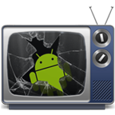

## You should stop using DroidShows

DroidShows still uses an old version of TheTVDB API. This worked just fine until recently, but in May 2023, many bugs were introduced:

- For some shows, the API now includes an episode 2 or 3 times
- For some shows, many episodes or even entire seasons are now completely missing from the API results

If you can, use a DroidShows backup _before_ May, 2023 and start using [this fork that uses TMDB](https://github.com/warren-bank/Android-Tiny-Television-Time-Tracker/releases).

I recommend trying out the [database migration tool](https://github.com/warren-bank/Android-Tiny-Television-Time-Tracker/releases/tag/db-migration-tool/001.00.02-11JRE), because the migration process inside the app itself is extremely slow and has a severe impact on your flash storage due to the many database operations. Otherwise, have _a lot_ of patience and try to keep the screen on during the migration process (`Options` > `Restore` > your `Droidshows.db`).

If these issues are (ever) resolved at TheTVDB, please do contact me and I'll update this message.

# DroidShows
by ltGuillaume: [Codeberg](https://codeberg.org/ltGuillaume) | [GitHub](https://github.com/ltGuillaume) | [Buy me a beer](https://buymeacoff.ee/ltGuillaume) 🍺

DroidShows: A Reboot of DroidSeries Offline TV Shows Tracker  
This fork adds quite a bunch of features, among which an improved interface, a menu overflow button, pinning, quick search and filters, a separate archive/backlog list, a last seen episodes log, swipe gestures, more show information, backup/restore, double episode entries clean-up, faster updating, cover and fan art view, a modern launcher icon and it speeds up responsiveness significantly by (more) efficient SQL queries and some threading. DroidShows only needs an internet connection when updating the show info or watching full-size posters.

__Some pointers__:
* Don't forget to update all shows regularly (pull-to-refresh)
* Context menu has more options (long-press item or use overflow buttons)
* Swipe left-to-right to go back  
__In Shows Overview__:
* Tap poster for next episode info
* Double tap for for show info
* Long-press poster external resource (to \*[url]s directly, or list)
* Swipe right-to-left to mark next as seen  
__In Show Details__:
* Tap poster for full-screen view
* Click full-screen poster image for fan art
* Long-press full-screen poster to open in external app  
__In Show/Episode Details__:
* Tap IMDb rating to view in IMDb App when installed, or on IMDb's mobile webpage

[Homepage](https://ltguillaume.github.io/DroidShows)  
[Wiki (FAQ)](https://github.com/ltGuillaume/DroidShows/wiki)  
[Screenshots & comparison with original DroidSeries](https://gallery.asymmetrics.nl/index.php?sfpg=RHJvaWRTZXJpZXMvKipkNGNiZTJhYzk1NjZmYWIwOTZhYWZiNGM4OWQyMTYyMA)  
[XDA Forum post / Changelog](https://forum.xda-developers.com/showthread.php?t=3136787)  
__Download APK__: from XDA forum post, [F-Droid Repository](https://f-droid.org/repository/browse/?fdid=nl.asymmetrics.droidshows) or [here](https://github.com/ltGuillaume/DroidShows/releases)

  
__Shows Overview__:  
\+ Put a "\*" before external source URLs to open them directly via a double tap on the poster (e.g. "\*battlestarwiki.org")  
\+ Optionally show "1x1 | Next airing: 1x4 on Jan 1, 2017" (Left = next episode for you to watch; Right = first episode to be aired)  
\+ Showing "[aired unwatched] of [total unwatched]"  
\+ Added separate archive/backlog to keep shows you're not currently watching out of your way  
\+ Added icon ic_menu_view for show/hide toggled  
\+ Status of show in details, and † in overview if show is not continuing  
\+ If show position changed, scroll back to show after [Mark next episode as seen] and Seasons list  
\+ Option to only update shows' latest season  
\+ Context items to view show details on FANDOM (Wikia), Rotten Tomatoes, Wikipedia and IMDb  
\+ Add your own per-show external resources (links to Wikia, blogs etc.)  
\+ Pin shows to the top of the list for easy access  
\+ Tap cover for next episode's info, long-press for show info, double tap for external resources  
\+ Swipe right-to-left to mark next episode as seen (shows confirmation toast)  
\+ Option to include specials in unwatched count  
\+ Mark next episode seen via swipe now vibrates  
\+ Optionally determine next episode by first unseen overall, or by last marked as watched  
\+ Undo function (until full exit)  
\+ A log that shows the last shows you've marked as seen
\+ Showing middot · when all new episodes are aired  
\+ New show & episode details views  
\+ View full size poster and fan art  
\+ Quick search (filter)  
\+ Exclude shows without unseen aired episodes  
\+ Added overflow buttons for easier access to context menus  
\+ Pull-To-Refresh to update shows  
\* Sorting shows by first unseen episode  
\* Clarified toggle and sort options  
\* Not showing "null" entries from DB  
\* Posters now fill row height, aspect ratios independent of screen's  
  
__Seasons/Episodes list__:  
\+ Showing "[aired] of [season episodes]"  
\+ Aired date in episodes list  
\+ Date of when episode was marked as seen is shown next to checkmark  
\+ Click on episode title for details, on checkmark to change seen state  
\+ Automatically scroll to current season / first unwatched episode  
\* Big performance improvement for entirely rewritten Seasons activity: is now almost instant  
  
__Add show__:  
\+ Icon resized rate_star_med_on_holo_dark for added shows  
\+ Icon ic_menu_add for new shows  
\+ Choose the synopsis language per show  
\* Fixed search not working after initial search  
\* Centered icons vertically in search results  
\* Large-size posters aren't cached, to save space in /data/data/  
  
__Update__:  
\* Prevent double episode entries  
  
__Other__:  
\+ Click on an episode air date to add it to your calendar  
\+ Option to use a mirror if TheTVDB.com is too slow in your region  
\+ Menu (overflow) button should show up in Android 3.0+  
\+ Dutch, French, German, Spanish and Russian translations  
\+ Choose which synopsis language to fetch from TheTVDB  
\+ Modern looking layout  
\+ Swipe left-to-right acts as back button  
\+ Animations that help understand the app's structure  
\+ Backup/restore database  
\+ Automatically create backups (max. once a day)
\* Date/time format according to locale  
\* Big performance improvement for Overview activity (values are kept up-to-date in series table)  
\* Some progress dialogs cancelable  
\* Update of all shows continues when navigating away from DroidShows  
\* Screen off/rotating screen/navigating away from app during update poses no problems anymore  
\* [Exit] removes app from memory  
\* Fixed UI glitches/styles  
\* Code clean-up (all layouts revised)  
  
&copy;2010 [Carlos Limpinho, Paulo Cabido](https://code.google.com/p/droidseries) under GPLv3  
Modified by Mikael Berthe  
&copy;2014-2018 Guillaume under GPLv3  
New icon is a mix of work by [Thrasos Varnava](https://iconeasy.com/icon/tv-shows-2-icon) and [Taenggo](https://wallalay.com/wallpapers-for-android-67-177682-desktop-background.html)
